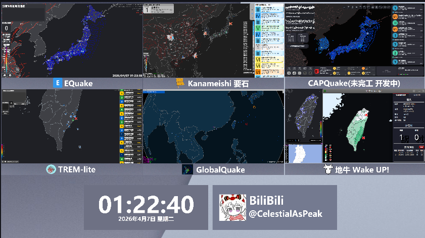

# 基于html的时钟


一个为 **1920×1080** 大屏幕（或任何分辨率）设计的全屏数字时钟。  
自动适配窗口大小，始终显示当前北京时间（24小时制）以及年月日、星期，适合用作 **信息看板、桌面时钟、电视投屏时钟**。

此为作者自用 但你也可以将它基于你的个性化修改后使用 也可以什么都不改 

作者将它用于OBS录屏



## ✨ 特性

- 🕒 超大时分秒显示，加粗无圆角，一眼看清
- 📅 下方显示年/月/日 + 星期（中文），字号约为时间的81%
- 📱 响应式布局：根据窗口宽高自动调整字体，防止溢出
- 🌏 使用 UTC+8（北京时间）
- 🖥️ 专为大屏优化（支持 1920×1080，也兼容其他比例）

## 🚀 使用方法

1. 将 `TimeClock.html` 保存到本地。
2. 使用任意浏览器打开该文件（推荐 Chrome / Edge / Firefox）。
3. 浏览器建议按 **F11** 进入全屏模式，获得最佳体验。
4. 时钟会自动开始运行，并随窗口大小变化调整字体。


## ⚙️ 自定义修改

### 更改背景颜色
在文件底部的 `<style>` 块中找到 `body { background-color: ... }`，修改颜色值即可。

### 调整日期与时间的字号比例
JavaScript 中搜索 `dateFontRatio` 变量，默认 `0.81`（日期字体是时间字体的 81%）。  
增大此值可使日期更大，减小则更小。

### 修改时区
默认使用 **UTC+8（北京时间）**。如需其他时区，可修改 `updateClock()` 中的偏移量：  
`let bjHour = (now.getUTCHours() + 8) % 24;`  
将 `8` 改为目标时区偏移（如日本为 `9`，英国为 `0`）。

### 调整日期格式
修改 `dateDisplaySpan.textContent = ...` 那一行，可自定义年月日星期格式，例如：
```js
`${year}/${month}/${day} ${weekStr}`   // 斜线分隔
